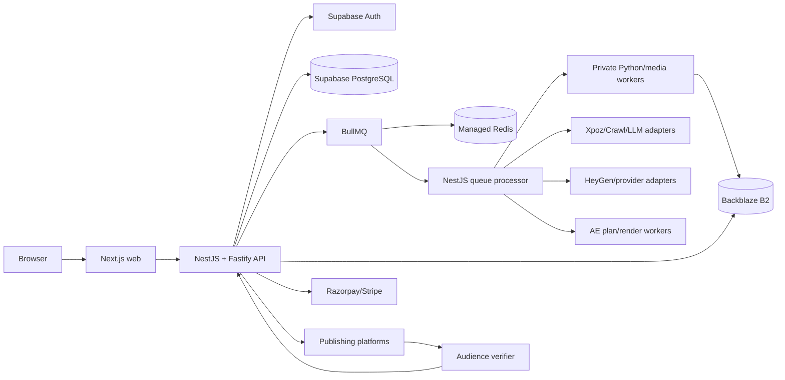

# Product V0 Sakhaa Forge Standalone Architecture

## Purpose

This is the implementation architecture for Product V0, Sakhaa Forge.
V0 is deployed and operated without Product V1 or Product V2.

## Ownership

- NestJS is the sole domain API and PostgreSQL writer.
- Prisma exclusively owns schema and migrations.
- BullMQ delivers opaque IDs; PostgreSQL owns jobs, credits and provider state.
- Python/media workers have no PostgreSQL or Redis credentials.
- Provider SDKs live behind adapters and never enter domain modules.
- V0 owns production generation, review, publishing, billing and performance capture.
- V0 stores enough immutable lineage for later V1/V2 use but does not call V2.
- V0-A3 statically enforces the V1/V2 absence boundary: the reference journey runs through `/api/v0`
  only, and a dedicated absence check asserts that the V0 OpenAPI document exposes no V1/V2 routes,
  the Prisma schema maps no V1/V2 tables or models, and the API runtime imports no V1/V2 modules.
  Schema-version suffixes (for example `ae.plan.v1`) are content fingerprints, not Product V1/V2
  runtime dependencies.

## Modules

- `identity`: users, workspaces, memberships and production roles.
- `brand`: crawl runs, candidates, approved profiles, assets and policy.
- `discovery`: Xpoz candidates, snapshots and selection.
- `blueprints`: thumbnail/video analysis, formulas, prompts and reusable library.
- `scripts`: tournaments, variants, scores and selection.
- `avatars`: catalog, client-owned avatars, consent and fulfillment.
- `generation`: estimates, provider operations, segments and reconciliation.
- `composition`: AE instructions, validated plans, render attempts and outputs.
- `billing`: wallets, purchases, reservations and append-only ledger.
- `review`: review items, comments, decisions and version history.
- `publishing`: calendar posts, provider operations, verification and notifications.
- `performance`: immutable platform snapshots and source attribution.
- `governance`: audit, rights, consent, retention and deletion.

## Storage

Use private buckets or equivalently isolated prefixes:

- `v0-media-quarantine`: crawled, uploaded and provider media awaiting validation.
- `v0-media-clean`: approved brand assets and final production media.
- `v0-artifacts-private`: blueprints, transcripts, frames, prompts, AE plans and evidence.

PostgreSQL stores ownership, hashes, status and retention. Presigned URLs are short-lived.
Provider URLs are transient and never the retained production source.

## Job Flow

1. NestJS commits domain state and an outbox row.
2. The relay enqueues an opaque job ID.
3. The queue processor atomically claims the PostgreSQL job.
4. It invokes a provider adapter or private worker.
5. Outputs are uploaded to B2.
6. Completion returns through NestJS with hashes and lineage.
7. NestJS advances state and records cost/audit events.

## Deployment

Deploy the API and always-on queue processor separately in India. Use Supabase
PostgreSQL/Auth, managed Redis and private B2 storage. Deploy Python/video workers by
resource class. V0 remains operational when V1 and V2 do not exist or are unavailable.

## Non-Negotiable Reliability

- Paid submissions are durable before network I/O.
- Timeouts after possible provider acceptance become `unknown`, not automatic retries.
- Credit reservation/capture/release is idempotent and transactional.
- Review approval precedes scheduling.
- Publishing acknowledgement precedes, but does not replace, audience verification.
- All external callbacks are authenticated, deduplicated and reconciled.
